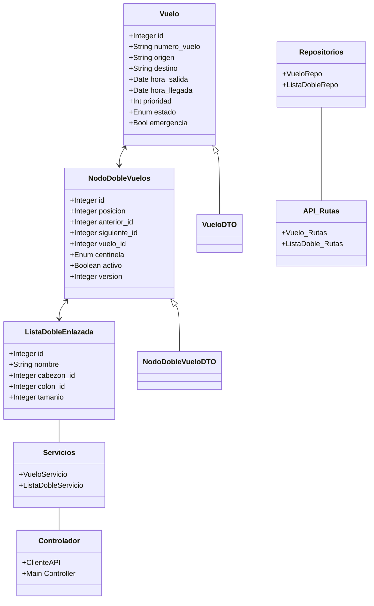
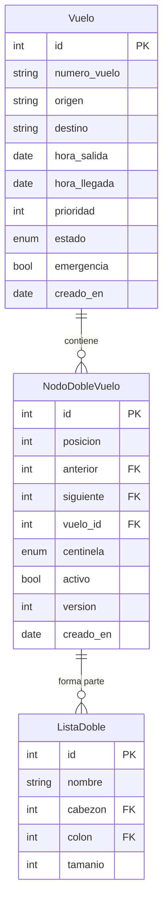
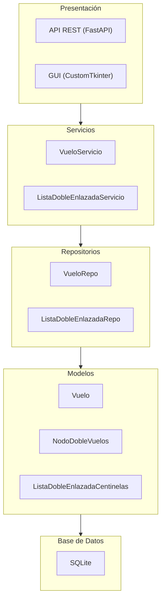
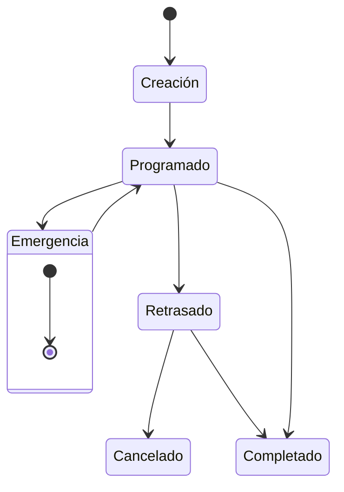
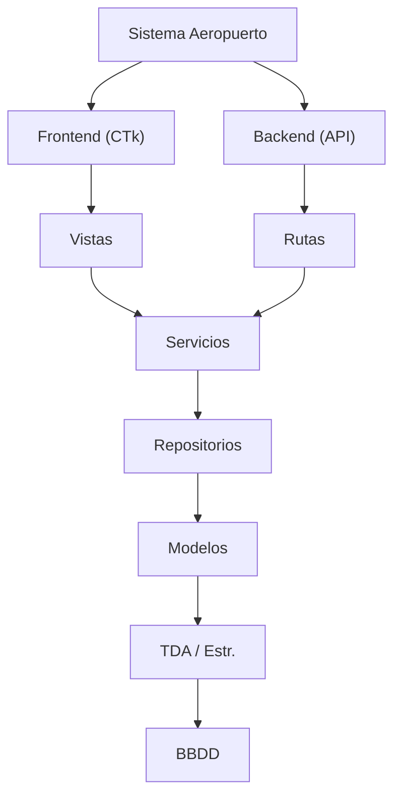

# 📊 Diagramas UML del Sistema

## Diagrama de Clases

```mermaid
classDiagram
    class Vuelo {
        +Integer id
        +String numero_vuelo
        +String origen
        +String destino
        +Date hora_salida
        +Date hora_llegada
        +Int prioridad
        +Enum estado
        +Bool emergencia
    }
    
    class NodoDobleVuelos {
        +Integer id
        +Integer posicion
        +Integer anterior_id
        +Integer siguiente_id
        +Integer vuelo_id
        +Enum centinela
        +Boolean activo
        +Integer version
    }
    
    class ListaDobleEnlazada {
        +Integer id
        +String nombre
        +Integer cabezon_id
        +Integer colon_id
        +Integer tamanio
    }
    
    class VueloDTO
    class NodoDobleVueloDTO
    
    class Repositorios {
        +VueloRepo
        +ListaDobleRepo
    }
    
    class API_Rutas {
        +Vuelo_Rutas
        +ListaDoble_Rutas
    }
    
    class Servicios {
        +VueloServicio
        +ListaDobleServicio
    }
    
    class Controlador {
        +ClienteAPI
        +Main Controller
    }
    
    Vuelo <--> NodoDobleVuelos
    NodoDobleVuelos <--> ListaDobleEnlazada
    Vuelo <|-- VueloDTO
    NodoDobleVuelos <|-- NodoDobleVueloDTO
    ListaDobleEnlazada -- Servicios
    Servicios -- Controlador
    Repositorios -- API_Rutas
```

## Diagrama de Entidad-Relación

```mermaid
erDiagram
    Vuelo {
        int id PK
        string numero_vuelo
        string origen
        string destino
        date hora_salida
        date hora_llegada
        int prioridad
        enum estado
        bool emergencia
        date creado_en
    }
    
    NodoDobleVuelo {
        int id PK
        int posicion
        int anterior FK
        int siguiente FK
        int vuelo_id FK
        enum centinela
        bool activo
        int version
        date creado_en
    }
    
    ListaDoble {
        int id PK
        string nombre
        int cabezon FK
        int colon FK
        int tamanio
    }
    
    Vuelo ||--o{ NodoDobleVuelo : "contiene"
    NodoDobleVuelo ||--o{ ListaDoble : "forma parte"
```

## Diagrama de Arquitectura

```mermaid
flowchart TB
    subgraph Presentacion["Presentación"]
        API["API REST (FastAPI)"]
        GUI["GUI (CustomTkinter)"]
    end
    
    subgraph Servicios["Servicios"]
        VS["VueloServicio"]
        LDES["ListaDobleEnlazadaServicio"]
    end
    
    subgraph Repositorios["Repositorios"]
        VR["VueloRepo"]
        LDER["ListaDobleEnlazadaRepo"]
    end
    
    subgraph Modelos["Modelos"]
        V["Vuelo"]
        NDV["NodoDobleVuelos"]
        LDE["ListaDobleEnlazadaCentinelas"]
    end
    
    subgraph BaseDeDatos["Base de Datos"]
        SQLite["SQLite"]
    end
    
    Presentacion --> Servicios
    Servicios --> Repositorios
    Repositorios --> Modelos
    Modelos --> BaseDeDatos
```

## Diagrama de Estados: Vuelo

```mermaid
stateDiagram-v2
    [*] --> Creación
    Creación --> Programado
    
    state Emergencia {
        [*] --> [*]
    }
    
    Programado --> Retrasado
    Retrasado --> Cancelado
    Retrasado --> Completado
    Programado --> Completado
    Programado --> Emergencia
    Emergencia --> Programado
```

## Diagrama de Componentes

```mermaid
flowchart TB
    Sistema["Sistema Aeropuerto"]
    Frontend["Frontend (CTk)"]
    Backend["Backend (API)"]
    Vistas["Vistas"]
    Rutas["Rutas"]
    Servicios["Servicios"]
    Repositorios["Repositorios"]
    Modelos["Modelos"]
    TDA["TDA / Estr."]
    BBDD["BBDD"]
    
    Sistema --> Frontend
    Sistema --> Backend
    Frontend --> Vistas
    Backend --> Rutas
    Vistas --> Servicios
    Rutas --> Servicios
    Servicios --> Repositorios
    Repositorios --> Modelos
    Modelos --> TDA
    TDA --> BBDD
```
