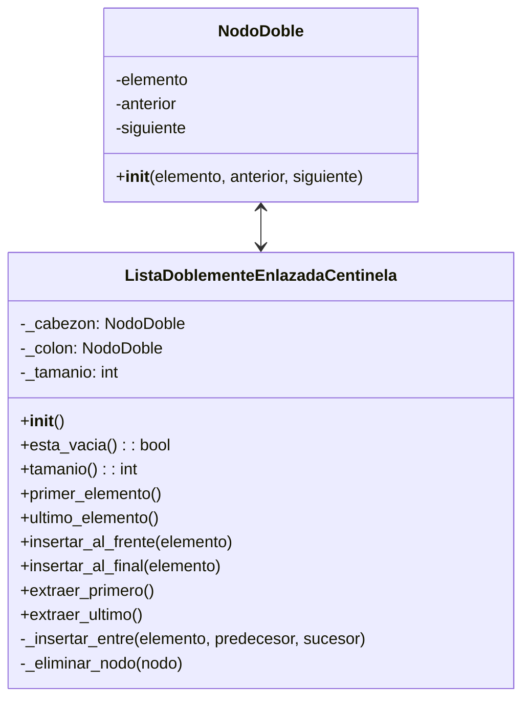

# 🧪 Implementación TDA Lista Doblemente Enlazada

## Definición del TDA

El Tipo de Dato Abstracto (TDA) Lista Doblemente Enlazada es una estructura de datos que permite almacenar elementos y acceder a ellos de manera no secuencial, con la particularidad de que cada nodo mantiene referencias tanto al nodo anterior como al siguiente.



## Componentes Clave

### 1. NodoDoble

La unidad básica de la lista doblemente enlazada:

```python
class NodoDoble:
    __slots__ = '_elemento', '_anterior', '_siguiente'
    
    def __init__(self, elemento=None, anterior=None, siguiente=None):
        self._elemento = elemento
        self._anterior = anterior
        self._siguiente = siguiente
```

### 2. Lista Doblemente Enlazada con Centinelas

La estructura principal que gestiona los nodos:

```python
class ListaDoblementeEnlazadaCentinela:
    def __init__(self):
        """Crea una lista vacía con nodos centinela"""
        self._cabezon = NodoDoble()  # Nodo centinela de inicio
        self._colon = NodoDoble()    # Nodo centinela de fin
        
        # Configuración inicial: los centinelas apuntan entre sí
        self._cabezon._siguiente = self._colon
        self._colon._anterior = self._cabezon
        
        # Contador de elementos
        self._tamanio = 0
    
    def esta_vacia(self):
        """Verifica si la lista está vacía"""
        return self._tamanio == 0
    
    def tamanio(self):
        """Devuelve el número de elementos en la lista"""
        return self._tamanio
    
    # Métodos de acceso
    
    def primer_elemento(self):
        """Devuelve (pero no elimina) el primer elemento"""
        if self.esta_vacia():
            raise ValueError("La lista está vacía")
        return self._cabezon._siguiente._elemento
    
    def ultimo_elemento(self):
        """Devuelve (pero no elimina) el último elemento"""
        if self.esta_vacia():
            raise ValueError("La lista está vacía")
        return self._colon._anterior._elemento
    
    # Métodos de modificación
    
    def insertar_al_frente(self, elemento):
        """Inserta un elemento al inicio de la lista"""
        self._insertar_entre(elemento, self._cabezon, self._cabezon._siguiente)
    
    def insertar_al_final(self, elemento):
        """Inserta un elemento al final de la lista"""
        self._insertar_entre(elemento, self._colon._anterior, self._colon)
    
    def extraer_primero(self):
        """Elimina y devuelve el primer elemento"""
        if self.esta_vacia():
            raise ValueError("La lista está vacía")
        return self._eliminar_nodo(self._cabezon._siguiente)
    
    def extraer_ultimo(self):
        """Elimina y devuelve el último elemento"""
        if self.esta_vacia():
            raise ValueError("La lista está vacía")
        return self._eliminar_nodo(self._colon._anterior)
    
    # Métodos auxiliares
    
    def _insertar_entre(self, elemento, predecesor, sucesor):
        """Insertar elemento entre dos nodos existentes"""
        nuevo_nodo = NodoDoble(elemento, predecesor, sucesor)
        predecesor._siguiente = nuevo_nodo
        sucesor._anterior = nuevo_nodo
        self._tamanio += 1
        return nuevo_nodo
    
    def _eliminar_nodo(self, nodo):
        """Elimina un nodo de la lista y devuelve su elemento"""
        predecesor = nodo._anterior
        sucesor = nodo._siguiente
        predecesor._siguiente = sucesor
        sucesor._anterior = predecesor
        self._tamanio -= 1
        elemento = nodo._elemento
        
        # Ayudar al recolector de basura
        nodo._anterior = nodo._siguiente = nodo._elemento = None
        
        return elemento
```

## Implementación Persistente

La implementación real del sistema utiliza una versión persistente del TDA con SQLAlchemy:

### 1. Modelos ORM

```python
class NodoDobleVuelos(Base):
    __tablename__ = "NodoDobleVuelos"
    
    # Campos básicos
    id = Column(Integer, primary_key=True, autoincrement=True)
    posicion = Column(Integer, nullable=True)
    
    # Enlaces de lista doblemente enlazada
    anterior_id = Column(Integer, ForeignKey('NodoDobleVuelos.id'), nullable=True)
    siguiente_id = Column(Integer, ForeignKey('NodoDobleVuelos.id'), nullable=True)
    
    # Relación con el elemento contenido
    vuelo_id = Column(Integer, ForeignKey('vuelos.id'), nullable=True)
    vuelo = relationship("Vuelo", back_populates="lista_item")
    
    # Metadatos
    centinela = Column(Enum("cabezon", "colon"), nullable=True)
    creado_en = Column(DateTime, default=datetime.now, nullable=False)
    activo = Column(Boolean, default=True, nullable=False)
    version = Column(Integer, default=1, nullable=False)
```

### 2. Repositorio

```python
class ListaDobleEnlazadaCentinelasRepo:
    def __init__(self, db: Session):
        self.db = db
    
    def crear_lista(self, nombre: str = "principal") -> ListaDobleEnlazadaCentinelas:
        """Crea una nueva lista con sus nodos centinela"""
        try:
            # Crear nodos centinela
            cabezon = NodoDobleVuelos(centinela="cabezon")
            colon = NodoDobleVuelos(centinela="colon")
            
            self.db.add(cabezon)
            self.db.add(colon)
            self.db.flush()  # Para obtener IDs
            
            # Enlazar centinelas
            cabezon.siguiente_id = colon.id
            colon.anterior_id = cabezon.id
            
            # Crear la lista
            lista = ListaDobleEnlazadaCentinelas(
                nombre=nombre,
                cabezon_id=cabezon.id,
                colon_id=colon.id,
                tamanio=0
            )
            
            self.db.add(lista)
            self.db.commit()
            return lista
            
        except SQLAlchemyError as e:
            self.db.rollback()
            raise e
```

### 3. Métodos de Manipulación

A continuación se muestran algunos métodos clave de la implementación del repositorio:

```python
def insertar_al_frente(self, lista_id: int, vuelo_id: int) -> Optional[NodoDobleVuelos]:
    """Inserta un vuelo al frente de la lista (después del cabezon)"""
    try:
        # Obtener la lista
        lista = self.obtener_lista_por_id(lista_id)
        if not lista:
            raise ValueError(f"Lista con ID {lista_id} no encontrada")
        
        # Obtener centinela cabezon
        cabezon = self.db.query(NodoDobleVuelos).get(lista.cabezon_id)
        
        # Obtener el nodo siguiente al cabezon
        primer_nodo = self.db.query(NodoDobleVuelos).get(cabezon.siguiente_id)
        
        # Crear nuevo nodo
        nuevo_nodo = NodoDobleVuelos(
            vuelo_id=vuelo_id,
            anterior_id=cabezon.id,
            siguiente_id=primer_nodo.id,
            posicion=0
        )
        
        self.db.add(nuevo_nodo)
        self.db.flush()  # Para obtener ID
        
        # Actualizar enlaces
        cabezon.siguiente_id = nuevo_nodo.id
        primer_nodo.anterior_id = nuevo_nodo.id
        
        # Incrementar tamaño de la lista
        lista.tamanio += 1
        
        # Actualizar posiciones
        self._actualizar_todas_posiciones(lista_id)
        
        self.db.commit()
        return nuevo_nodo
        
    except SQLAlchemyError as e:
        self.db.rollback()
        raise e
```

```python
def extraer_primero(self, lista_id: int) -> Optional[NodoDobleVuelos]:
    """Extrae y devuelve el primer nodo de la lista (después del cabezon)"""
    try:
        # Obtener la lista
        lista = self.obtener_lista_por_id(lista_id)
        if not lista:
            raise ValueError(f"Lista con ID {lista_id} no encontrada")
        
        if lista.tamanio == 0:
            return None  # Lista vacía
        
        # Obtener centinela cabezon
        cabezon = self.db.query(NodoDobleVuelos).get(lista.cabezon_id)
        
        # Obtener el primer nodo (después del cabezon)
        primer_nodo = self.db.query(NodoDobleVuelos).get(cabezon.siguiente_id)
        
        # Obtener el siguiente del primer nodo
        siguiente_nodo = self.db.query(NodoDobleVuelos).get(primer_nodo.siguiente_id)
        
        # Reconectar los enlaces
        cabezon.siguiente_id = siguiente_nodo.id
        siguiente_nodo.anterior_id = cabezon.id
        
        # Marcar como inactivo pero conservar para historial
        primer_nodo.activo = False
        primer_nodo.anterior_id = None
        primer_nodo.siguiente_id = None
        
        # Decrementar tamaño
        lista.tamanio -= 1
        
        # Actualizar posiciones
        self._actualizar_todas_posiciones(lista_id)
        
        self.db.commit()
        return primer_nodo
        
    except SQLAlchemyError as e:
        self.db.rollback()
        raise e
```

## Algoritmos Especializados

### Reordenamiento por Prioridad

```python
def reordenar_por_prioridad(self, lista_id: int) -> bool:
    """Reordena la lista en base a prioridad y estado de emergencia"""
    try:
        # Obtener lista y nodos activos
        lista = self.obtener_lista_por_id(lista_id)
        nodos = self.obtener_nodos_activos(lista_id)
        
        # Extraer vuelos y ordenar
        vuelos = []
        for nodo in nodos:
            if nodo.vuelo:
                vuelos.append(nodo.vuelo)
        
        # Ordenar por criterios múltiples
        vuelos_ordenados = sorted(
            vuelos,
            key=lambda v: (
                -int(v.emergencia),  # Emergencia primero
                -v.prioridad,        # Mayor prioridad primero
                # Estado (programado, retrasado, cancelado)
                0 if v.estado == 'programado' else 
                1 if v.estado == 'retrasado' else 2,
                v.hora_salida        # Por hora de salida ascendente
            )
        )
        
        # Reconstruir lista ordenada
        self._reconstruir_lista_ordenada(lista_id, vuelos_ordenados)
        
        return True
        
    except SQLAlchemyError as e:
        self.db.rollback()
        raise e
```

### Mover Nodo Entre Posiciones

```python
def mover_nodo_entre_posiciones(self, lista_id: int, posicion_origen: int, posicion_destino: int) -> bool:
    """Mueve un nodo desde una posición a otra en la lista"""
    try:
        # Validar posiciones
        if posicion_origen == posicion_destino:
            return True  # Nada que hacer
            
        # Obtener nodos activos
        nodos_activos = self.obtener_nodos_activos(lista_id)
        
        # Verificar rango válido
        if (posicion_origen < 0 or posicion_origen >= len(nodos_activos) or
            posicion_destino < 0 or posicion_destino >= len(nodos_activos)):
            raise ValueError("Posición fuera de rango")
            
        # Obtener el nodo a mover
        nodo_origen = nodos_activos[posicion_origen]
        
        # Desconectar el nodo de su posición actual
        anterior_origen = self.db.query(NodoDobleVuelos).get(nodo_origen.anterior_id)
        siguiente_origen = self.db.query(NodoDobleVuelos).get(nodo_origen.siguiente_id)
        
        anterior_origen.siguiente_id = siguiente_origen.id
        siguiente_origen.anterior_id = anterior_origen.id
        
        # Obtener nodo en la posición destino
        nodo_destino = nodos_activos[posicion_destino]
        
        # Algoritmo de inserción (antes o después según la dirección)
        if posicion_destino < posicion_origen:
            # Insertar antes
            anterior_destino = self.db.query(NodoDobleVuelos).get(nodo_destino.anterior_id)
            
            # Conectar el nodo en su nueva posición
            nodo_origen.anterior_id = anterior_destino.id
            nodo_origen.siguiente_id = nodo_destino.id
            
            # Actualizar los enlaces
            anterior_destino.siguiente_id = nodo_origen.id
            nodo_destino.anterior_id = nodo_origen.id
        else:
            # Insertar después
            siguiente_destino = self.db.query(NodoDobleVuelos).get(nodo_destino.siguiente_id)
            
            # Conectar el nodo en su nueva posición
            nodo_origen.anterior_id = nodo_destino.id
            nodo_origen.siguiente_id = siguiente_destino.id
            
            # Actualizar los enlaces
            nodo_destino.siguiente_id = nodo_origen.id
            siguiente_destino.anterior_id = nodo_origen.id
        
        # Actualizar todas las posiciones
        self._actualizar_todas_posiciones(lista_id)
        
        self.db.commit()
        return True
        
    except SQLAlchemyError as e:
        self.db.rollback()
        raise e
```

## Ventajas de la Implementación Persistente

1. **Durabilidad**: Los datos de la estructura sobreviven a reinicios del sistema
2. **Historial**: Versión y marcado histórico de nodos para seguimiento
3. **Transaccionalidad**: Operaciones atómicas con soporte para rollback
4. **Integración**: Completa integración con el sistema ORM
5. **Flexibilidad**: Permite extender la estructura para agregar metadatos

## Complejidad Algorítmica

| Operación | Complejidad | Justificación |
|-----------|-------------|---------------|
| Inserción en extremos | O(1) + DB | Operación directa con centinelas |
| Inserción en posición | O(n) + DB | Requiere recorrido hasta la posición |
| Extracción en extremos | O(1) + DB | Operación directa con centinelas |
| Extracción en posición | O(n) + DB | Requiere recorrido hasta la posición |
| Reordenamiento | O(n log n) + DB | Dominado por el algoritmo de ordenamiento |
| Mover nodo | O(n) + DB | Requiere recorrido para encontrar posiciones |

Nota: "+ DB" indica el costo adicional de transacciones con la base de datos

## Ejemplos de Uso en el Código del Sistema

### Creación de la Lista

```python
@router.post("/lista/inicializar", response_model=ListaDobleEnlazadaCentinelasDTO)
def inicializar_lista(db: Session = Depends(get_db)):
    servicio = ListaDobleEnlazadaServicio(db)
    return servicio.crear_lista_principal()
```

### Inserción de un Vuelo

```python
@router.post("/lista/{lista_id}/vuelos/{vuelo_id}", response_model=NodoDobleVueloDTO)
def insertar_vuelo(lista_id: int, vuelo_id: int, db: Session = Depends(get_db)):
    servicio = ListaDobleEnlazadaServicio(db)
    
    # Verificar si el vuelo ya está en la lista
    if servicio.vuelo_esta_en_lista(vuelo_id):
        raise HTTPException(
            status_code=400,
            detail="El vuelo ya está en la lista"
        )
    
    try:
        nodo = servicio.insertar_al_final(lista_id, vuelo_id)
        return nodo
    except Exception as e:
        raise HTTPException(
            status_code=400,
            detail=str(e)
        )
